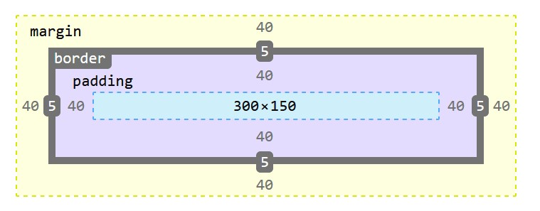
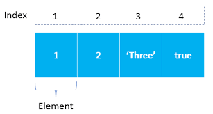

HTML
## List
- Lists are used to group together related pieces of information and there are three type of list
  - *Ordered lists* (<ol>):each item in the list is numbered. 
  - *Unordered lists* (<ul>): are lists that begin with a bullet point
  - *Definition lists* (<dl>): are made up of a set of terms along with the definitions for each of those terms.
Inside the <dl> element you will usually see pairs of <dt> contain the term being defined and <dd> contain the definition.
ex : 
```
<dl>
<dt>Sashimi</dt>
<dd>Sliced raw fish that is served with
condiments such as shredded daikon radish or
ginger root, wasabi and soy sauce</dd>
</dl>
```
- and you can make list inside list which called nested list
## boxes
- By default a box is sized just big enough to hold its contents.
- set your own dimensions for a box you can use the height and width properties
ex ```div.box {
height: 300px;
width: 300px;}```
  - you can Limiting Width (min-width, max-width) and Height (min-height, max-height)

- The overflow property tells the browser what to do if the content contained within a box is larger than the box itself
- Every box has three available properties that can be adjusted to control its appearance:
  - Border separates the edge of one box from another
  - margin create a gap between the borders of two adjacent boxes.
  - padding space between the border and its content
- CSS3 has introduced the ability to create image borders and rounded borders


# js
### array
- An array is a special type of variable. it stores a list of values
to declear array :
  - ```var x;
	x=['element1','element2','element3',...]```
  - array constructor:
```var colors =new Array('white ' ,'black','custom ' );```
- Each item in an array is automatically given a number called an index.
  - index start from 0
- ACCESSING ITEMS IN AN ARRAY :x[2]; to acces the element that has index number 2
- length holds the number of items in the array
- you can change the value of elemnt inside the array using this technique :
```x[2] = 'new value';```

### switch
A switch statement starts with a variable called the switch value. Each case indicates a possible value for this variable and the code that should run if the
variable matches that value.
- syntax
```switch(expression) {
  case x:
    // code block
    break;
  case y:
    // code block
    break;
  default:
    // code block
}```
DATA TYPE PURPOSE
string => Text
number => Number
Boolean => true or false
null  =>  Empty value
undefined => Variable has been declared but not yet assigned a value

**type coercion** : JavaScript can convert data types behind the scenes to complete an operation
**strong typing** :specify what data type each variable will be.
- JavaScript is said to use weak typing because the data type for a value can change.
**unary operator ** returns a result with just one operand.


## loops
if you want to run the same code over and over again, each time with a different value.
- there are three common types of loop:
  - for if you need to run the code specific number of time
syntax:
for (initial state; condition; incrementor decrement) {
  // code block to be executed
}
  - while if you dont know how many times you need to run the code
syntax :
while (condition) {
  // code block to be executed
}
  - do while same as while but the difference it that will run the statement inside barces at least one time even if the condition is false
syntax:
do {
  // code block to be executed
}
while (condition);

### KEY LOOP CONCEPTS:
**break**:This keyword causes the termination of the loop and tells the interpreter to go onto the next statement of code outside of the loop.
**continue**: This keyword te lls the interpreter to continue with the current iteration, and then check the condition again.
