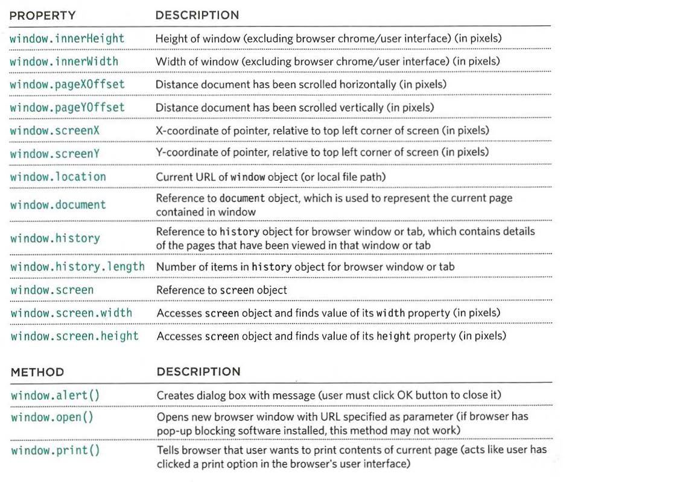
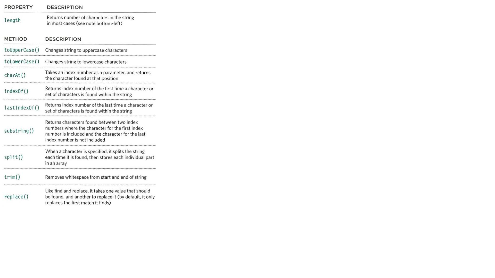
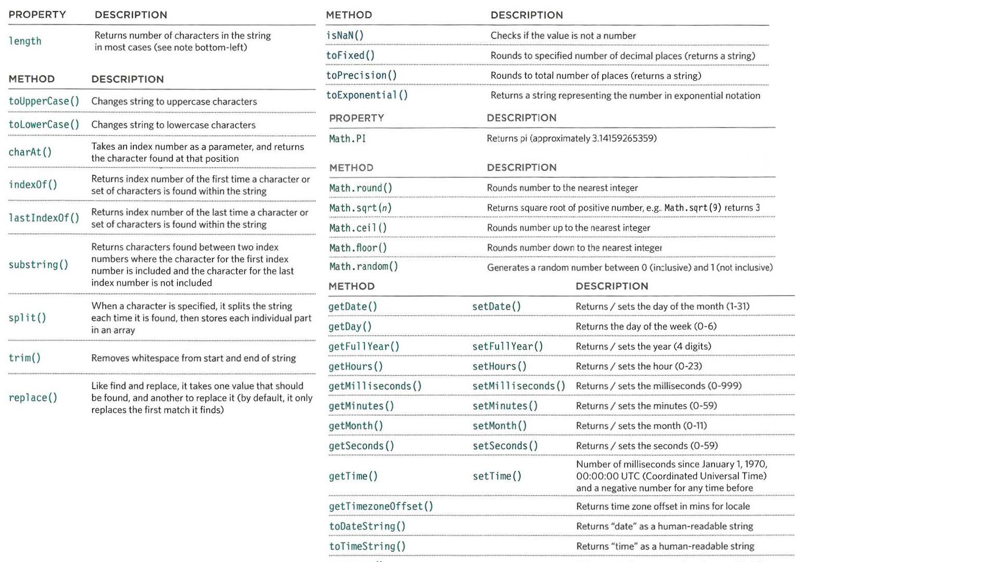

# HTML
## table
- A table represents information in a grid format.
- Grids allow us to understand complex data by referencing information on two axes.
- Each block in the grid is referred to as a table cell
- The <table> element is used to create a table. The contents of the table are written out row by row.
  - <tr> start of each row It is followed by one or more <td> elements (one for each cell in that row).(The td stands fortable data.)
  - At the end of each cell you use a closing </td> tag.
  - The <th> element is used just like the <td> element but its purpose is to represent the heading for either a column or a row. (The th stands for table heading.)
- The colspan attribute can be used on a <th> or <td> element and indicates how many columns that cell should run across.
- The rowspan attribute can be used on a <th> or <td> element to indicate how many rows a cell should span down the table.
- <thead> The headings of the table should sit inside the <thead> element.
- <tbody> The body should sit inside the <tbody> element.
- <tfoot> The footer belongs inside the <tfoot> element.
- Some of the HTML editors that come in content management systems offer tools to help draw tables. If the first row of your table only contains <th> elements then you may find that the editor inserts a <thead> element automatically.

# Java Script
## Object
### ***constructor***
- the new keyword and the object constructor create a blanck object then you can  add properties and methods to object
```var object_name = new object()```
- then using dot notation you can add properties and methods
```object_name.property_name = value;
   object_name.method_name = function(){};
```
- to delete property
```delete object_name.property_name;```
- Sometimes you will want several objects to represent similar things. Object constructors can use a function as a template for creating objects
- **this** keyword is used instead of the object name to indicate that the property or method belongs to the object that this function creates.
  - commonly used inside functions and objects.
- The name of a constructor function usually begins with a capital letter
- **A FUNCTION IN GLOBAL SCOPE** :When a function is created at the top level of a script
- **method** When a function is defined inside an object
To access the properties or methods of the object,use dot notation:
```object_name.property_name;```
- MULTIPLE OBJECTS :When you need to create multiple objects within the same page, you should use an object constructor to provide a template for the objects.
- array is a special type of object the key for each value is index
  - array can contain an multi object and object can contain multi array


- Browsers come with a set of built-in objects that represent things like the browser window and the current web page shown in that window.
- **object model ** is a group of objects, each of which represent related things from the real world
three groups of built in object model :
  - **The Browser Object Model**: contains objects that represent the current browser window or tab. It contains objects that model things like browser history and the device's screen.
  
  - **DOCUMENT OBJECT MODEL**:uses objects to create a representation of the current page. It creates a new object for each element
  
  - **GLOBAL JAVASCRIPT OBJECTS**: represent things that the JavaScript language needs to create a model of.



