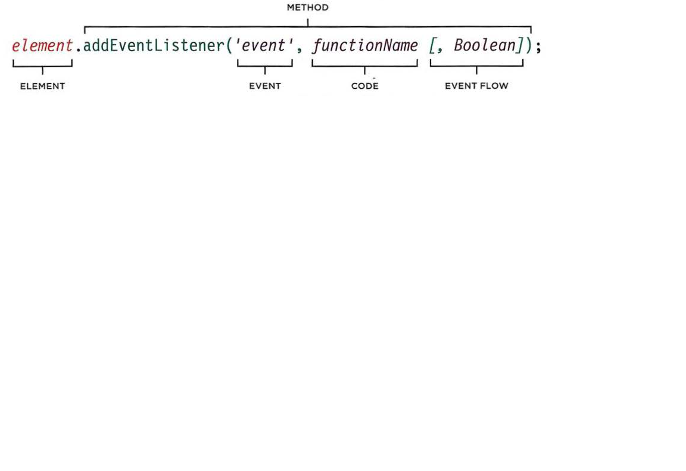

# HTML
**form controls**
There are several types of form controls that you can use to collect information from visitors to your site.
  - ADDING TEXT:Text input (single-line),Password input and Text area (multi-line)
  - Making Choices: Radio buttons For use when a user must select one of a number of options,Checkboxes When a user can select and unselect one or more options and Drop-down boxes When a user must pick one of a number of options from a list.
  - Submitting Forms: Submit buttons To submit data from your form to another web page and Image buttons Similar to submit buttons but they allow you to use an image
  - Uploading Files: File upload Allows users to upload files
How Forms Work :A user fills in a form and then presses a button to submit the information to the server.
- A form may have several form controls, each gathering different information. The server needs to know which piece of inputted data corresponds with which form element.
- `<form>` :This element should always carry the action attribute and will usually have a method and id attribute too
  - action attribute. Its value is the URL for the page on the server that will receive the information in the form when it is submitted
  - method :Forms can be sent using one of two methods: **get** the values from the form are added to the end of the URL The get method is ideal for: short forms and when you are just retrieving data from the web server or **post**values are sent in what are known as HTTP headers.use the post method if your form:allows users to upload a file is very long or contains sensitive data or adds information to, or deletes information from, a database
  - id :used to identify the form distinctly from other elements on the page
  - The <input> element is used to create several different form controls.its attribute is :type="text",name,size(The size attribute should not be used on new forms.) and maxlength(You can use the maxlength attribute to limit the number of characters a user may enter)
- `<select>`:
  - size :You can turn a drop down select box into a box that shows more than one option by adding the size attribute.
  - multiple You can allow users to select multiple options from this list
- `<input>`:If you want to allow users to upload a file
  - type="file"
  - type="submit"
- `<button>` to allow users more control over how their buttons appear, and to allow other elements to appear inside the button.
- `<label>` each form control should have its own <label> element as this makes the form accessible to vision-impaired users.
- `<fieldset>` You can group related form controls together inside the
- `<fieldset>` tag and contains a caption which helps identify the purpose of that group of form controls.
- **form validation** :give users messages if the form control has not been filled in correctly
- type="date" If you are asking the user for a date, you can use an <input> element and give the type attribute a value of date.
- `type="email"`or `type="url"` or `type="search"`
## Lists, Tables and Forms
- The list-style-type property allows you to control the shape or style of a bullet point (alsoknown as a marker):
- Unordered Lists:For an unordered list you can use the following values:
  - none
  - disc
  - circle
  - square
- Ordered Lists:For an ordered (numbered) list 
- You can specify an image to act as a bullet point using the list-style-image property.
- list-style-position attribute :
  - outside The marker sits to the left of the block of text.
  - inside The marker sits inside the box of text
- Table properties:
  - width to set the width of the table
  - padding to set the space between the border of each table cell and its content
  - text-transform to convert the content of the table headers to uppercase
  - letter-spacing, font-size
  - border-top, border-bottom
  - text-align
  - background-color
  - :hover :to highlight a table row when a user's mouse goes over it
- tips for styling tables:
  - Give cell s padding
  - Distinguish headings
  - Shade alternate rows
  - Align numerals
- use the empty-cells property to specify whether or not their borders should be shown.
  - show This shows the borders of any empty cells.
  - hide
  - inherit
- Gaps Between Cells : border-spacing(separate): Borders are detached from each other., border-collapse :Borders are collapsed into a single border where possible.
- Styling Text:
  - font-size
  - color 
  - border-radius can be used to create rounded corners
  - :focus pseudo-class is used to change the background color of the text input when it is being used
  - background-color
  - :hover psuedo-class applies the same styles when the user hovers over them
  - background-image
- styling submitt button
  - color
  - text-shadow
  - border-bottom
  - background-color
  - :hover
- Styling Fieldsets & Legends
  - width is used to control the width of the fieldset
  - color
  - background-color
  - border
  - border-radius
  - padding
- cursor style :The cursor property allows you to control the type of mouse cursor that should be displayed to users.
- Web Developer Toolbar :
  - Outlines When you hover over an element, a red outline will be drawn around it,
  - Structure While you are hovering over an element, the structure will be shown at the top of the window
  - 3: CSS styles When hovering over an element,click with your mouse to display the CSS
# JS
## event 
- When an event has occurred, it is often described as having **fired**or **raised**
- Events are said to t rigger a function or script. When the click event fires on the element in this diagram, it could trigger a script that enlarges the selected item.
- **MUTATION EVENTS **Occur when the DOM structure has been changed by a script To be replaced by mutation observers
- event handling steps :
  - Select the element node(s) you want the script to respond to
  - Indicate which event on the selected node(s) will trigger the response.Programmers call this ***binding*** an event to a DOM node.
  - State the code you want to run when the event occurs.
- There are three types of event handlers.
  - HTML EVENT HANDLERS
  - TRADITIONAL DOM EVENT HANDLERS
  - DOM LEVEL 2 EVENT LISTENERS
- All modern browsers understand this way of creating an event handler,but you can only attach one function to each event handler.
  - syntax to bind an event to an element

- Event listeners are a more recent approach to handling events
  - They can deal with more than one function at a time but they are not supported in older browsers.
  - syntax to bind an event to an element using an event listener

- When an event occurs, the event object tells you information about the event, and the element it happened upon.
-Every time an event fires, the The event object is passed to event object contains helpful any function that is the event data about the event
  - Which element the event happened on
  - Which key was pressed
  - What part of the viewport the user clicked for a c1ick event
- Creating event listeners for a lot of elements can slow down a page, but event flow allows you to listen for an event on a parent element
- BENEFITS OF EVENT DELEGATION
  - WORKS WITH NEW ELEMENTS
  - SOLVES LIMITATIONS WITH this KEYWORD
  - SIMPLIFIES YOUR CODE
- The event object has methods that change: the default behavior of an element and how the element's ancestors respond to the event
- When calling a function, the event object's target property is the best way to determine which element the event occurred on
- Events are defined in:
  - W3C DOM EVENTS
  - HTM LS EVENTS
  - SOM EVENTS :Browser manufacturers also implement some events as part of their Browser
- User interface CUI) events occur as a result of interaction with the browser window rather than the HTML page contained within it
- The HTML elements you can interact with, such as links and form elements, can gain focus. These events fire when they gain or lose focus
- The mouse events are fired when the mouse is moved and also when its buttons are clicked
- The keyboard events are fired when a user interacts with the keyboard
- Whenever elements are added to or removed from the DOM, its structure changes. This change triggers a mutation event.

