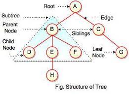

# Trees
-  is a nonlinear data structure

### Common Terminology

- Node : is a component which may contain it’s own values, and references to other nodes
- Root : is the node at the beginning of the tree
- K : A number that specifies the maximum number of children any node may have in a k-ary tree.
- Left : A reference to one child node, in a binary tree
- Right : A reference to the other child node, in a binary tree
- Leaf : is a node that does not have any children
- Edge : is the link between a parent and child node
- Height : is the number of edges from the root to the furthest leaf

### Traversals
- allows us to search for a node, print out the contents of a tree
**categories of traversals :**
- Depth First :
Here are three methods for depth first traversal:
  - Pre-order: root >> left >> right
  - In-order: left >> root >> right
  - Post-order: left >> right >> root
**The most common way to traverse through a tree is to use recursion.**

- **Breadth First:**
- first traversal iterates through the tree by going through each level of the tree node-by-node. 
- breadth first traversal uses a queue (instead of the call stack via recursion) to traverse the width/breadth of the tree.

## Binary Tree Vs K-ary Trees
- Trees can have any number of children per node, but Binary Trees restrict the number of children to two
- There is no specific sorting order for a binary tree. Nodes can be added into a binary tree wherever space allows. 

### Adding a node
- One strategy for adding a new node to a binary tree is to fill all “child” spots from the top down
- In the event you would like to have a node placed in a specific location, you need to reference both the new node to create, and the parent node upon which the child is attached to.
- The Big O time complexity for inserting a new node is O(n). Searching for a specific node will also be O(n). Because of the lack of organizational structure in a Binary Tree,
- The Big O space complexity for a node insertion using breadth first insertion will be O(w), where w is the largest width of the tree.

## Binary Search Tree (BST) 
In a BST, nodes are organized in a manner where all values that are smaller than the root are placed to the left, and all values that are larger than the root are placed to the right.

- Searching a BST can be done quickly, because all you do is compare the node you are searching for against the root of the tree or sub-tree. If the value is smaller, you only traverse the left side. If the value is larger, you only traverse the right side.

- The Big O time complexity of a Binary Search Tree’s insertion and search operations is O(h), or O(height)
- The Big O space complexity of a BST search would be O(1). During a search, we are not allocating any additional space.

