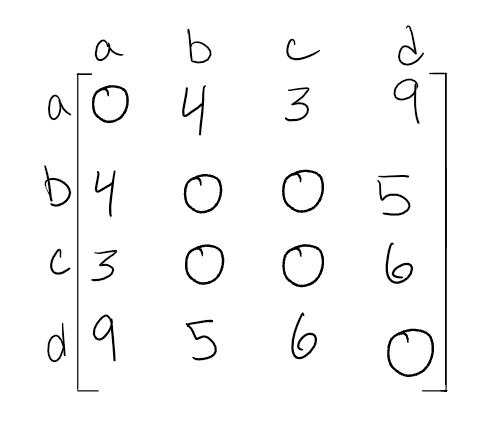

# graph 
 is a non-linear data structure that can be looked at as a collection of vertices (or nodes) potentially connected by line segments named edges.
- common terminology used when working with Graphs:
  - vertex is a data object that can have zero or more adjacent vertices.
  - edge is a connection between two nodes.
  - neighbors of a node are its adjacent vertex are connected via an edge.
  - Degree is the number of edges connected to that vertex.
### Directed vs Undirected
- Undirected Graph 
is a graph where each edge is undirected or bi-directional. This means that the undirected graph does not move in any direction.
- Directed Graphs
also called a Digraph is a graph where every edge is directed and  has direction. Each node is directed at another node with a specific requirement of what node should be referenced next.

### types of graphs:
1. Complete Graphs:when all nodes are connected to all other nodes.
2. Connected :is graph that has all of vertices/nodes have at least one edge.
3. Disconnected :is a graph where some vertices may not have edges.

### Acyclic vs Cyclic
- Acyclic Graph : is a directed graph without cycles.cycle is when a node can be traversed through and potentially end up back at itself.
- cycle is when a node can be traversed through and potentially end up back at itself.
A cycle is defined as a path of a positive length that starts and ends at the same vertex.

### Graph Representation
- Adjacency Matrix(2D array):
The elements of both the column and the row must add up to 1 if there is an edge that connects the two, or zero if there isn’t a connection.
  - **sparse** graph is when there are very few connections. 
  - **dense** graph is when there are many connections 

- Adjacency List
is a collection of linked lists or array that lists all of the other vertices that are connected.
most common way to represent graphs.

### Weighted Graphs
is a graph with numbers assigned to its edges. These numbers are called weights. 

  - weight matrix

  - Within adjacency lists, you must include both the weight and the name of the adjacent vertex

### Traversals
- Breadth First
- Depth First

### Real World Uses of Graphs
- GPS and Mapping
- Driving Directions
- Social Networks
- Airline Traffic
- Netflix uses graphs for suggestions of products

