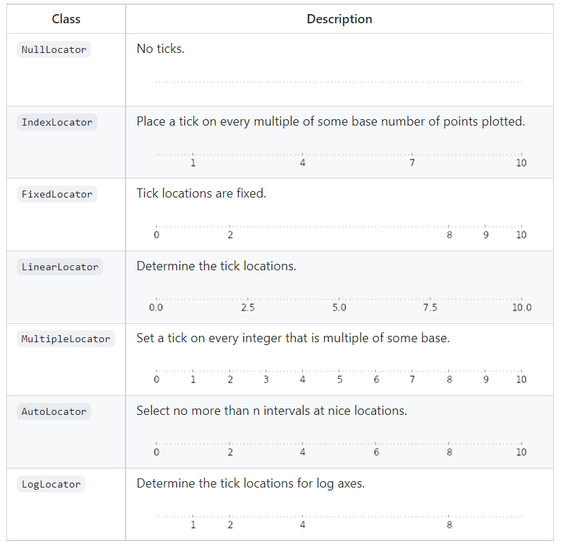

# Matplotlib Tutorial
matplotlib is probably the single most used Python package for 2D-graphics. It provides both a very quick way to visualize data from Python and publication-quality figures in many formats. We are going to explore matplotlib in interactive mode covering most common cases.

## IPython
is an interactive shell that is built with python. It provides a more useful shell environment to execute

## pyplot 
is a state-based interface to matplotlib. It provides a MATLAB-like way of plotting. pyplot is mainly intended for interactive plots and simple cases of programmatic plot generation
- You can control the defaults of almost every property in matplotlib: figure size and dpi, line width, color and style, axes, axis and grid properties, text and font properties and so on.
  - Instantiating defaults
  - Changing colors and line widths
  - Setting limits
  - Setting ticks
  - Setting tick labels
  - Moving spines
  - Adding a legend
  - Annotate some points
  - Devil is in the details

## Figures
 is the windows in the GUI that has "Figure #" as title. Figures are numbered starting from 1 as opposed to the normal Python way starting from 0
- There are several parameters that determine what the figure looks like:

## Subplots
With subplot you can arrange plots in a regular grid. You need to specify the number of rows and columns and the number of the plot

## Axes
Axes are very similar to subplots but allow placement of plots at any location in the figure. So if we want to put a smaller plot inside a bigger one we do so with axes.

## Ticks
Well formatted ticks are an important part of publishing-ready figures. Matplotlib provides a totally configurable system for ticks. There are tick locators to specify where ticks should appear and tick formatters to give ticks the appearance you want. Major and minor ticks can be located and formatted independently from each other
- Tick Locators

## Animation
The most easy way to make an animation in matplotlib is to declare a FuncAnimation object that specifies to matplotlib what is the figure to update, what is the update function and what is the delay between frames.

## Drip drop
A very simple rain effect can be obtained by having small growing rings randomly positioned over a figure.

## Earthquakes
to visualize earthquakes on the planet from the last 30 days. The USGS Earthquake Hazards Program is part of the National Earthquake Hazards Reduction Program (NEHRP) and provides several data on their website. 

## Other Types of Plots
1. regular plot :plot lines and or markers
2. scatter plot : make a scatter plot of x vs y
3. Bar plot :make a bar plots with rectangle
4. contour plot : draw contour lines and feild contours 
5. imshow : display image
6. Quiver plot : plot a 2d feild of arrows 
7. pie chart : make a pie chart of array
8. Grid : draw ticks and grid
9. multiplot : plot several plot at once
10. polar axis :plot anything using polar coordinate
11. 3d plots :plot 2d or 3d data
12. text :draw any kind of text

