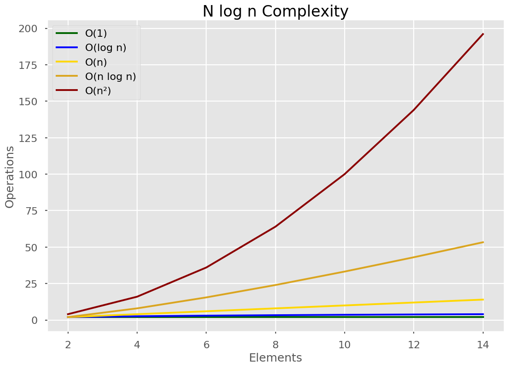
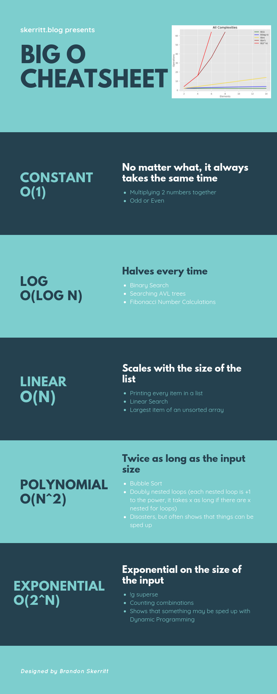

# Python Scope
**scope** rules how variables and names are looked up in your code. It determines the visibility of a variable within the code
The Python scope concept is generally presented using a rule known as the LEGB rule:
**Local, Enclosing, Global, and Built-in** scopes.
- the scope of a name defines the area of a program in which you can unambiguously access that name Several programming languages take advantage of scope for avoiding name collisions and unpredictable behaviors
- general scopes:
  - Global scope: available to all your code.
  - Local scope: available or visible to the code within the scope.
- variables in Python come into existence when you first assign them a value. On the other hand, functions and classes are available after you define them using def or class
- Python uses the location of the name assignment or definition to associate it with a particular scope
- Python scopes are implemented as dictionaries that map names to objects These dictionaries are commonly called namespaces
- Python use mechanisim to store names. They’re stored in a special attribute called `.__dict__.`
- After you `import sys`, you can use `.keys()` to inspect the keys of s`ys.__dict__.` This returns a list with all the names defined at the top level of the module.

- Once you’ve imported sys you can access ps1 using the dot notation on sys. You can also access ps1 using a dictionary key lookup with the key `'ps1'`
  - `sys.ps1`
  - `sys.__dict__['ps1']`
## Using the LEGB Rule for Python Scope :
1- Local (or function) scope :is the code block or body of any Python function or lambda expression. This Python scope contains the names that you define inside the function.
  - The local scope or function scope is a Python scope created at function calls. Every time you call a function, you’re also creating a new local scope
2- Enclosing (or nonlocal) scope : exists for nested functions.the enclosing scope is the scope of the outer or enclosing function
  - The names in the enclosing scope are visible from the code of the inner and enclosing functions.
  - When you call outer_func(), you’re also creating a local scope. The local scope of outer_func() is, at the same time, the enclosing scope of inner_func
  - All the names that you create in the enclosing scope are visible from inside inner_func
  - inner_func, this scope is neither the global scope nor the local scope. It’s a special scope that lies in between those two scopes and is known as the enclosing scope.
3- Global (or module) scope : Names in this Python scope are visible from everywhere in your code.
  - If you call dir() without arguments, then you’ll get the list of names that live in your current global scope
  - if you assign a new name (like `var` here) at the top level of the module (which is` __main__` here), then that name will be added to the list returned by `dir()`.
4- Built-in scope : Names in this Python scope are also available from everywhere in your code. It’s automatically loaded by Python when you run a program or script.
  - `square()` is a function that computes the square of a given number
  - If you override or re-assign abs, then the original built-in abs() is affected all over your code

- Modifying global names is generally considered bad programming practice because it can lead to code that is:

  - Difficult to debug: Almost any statement in the program can change the value of a global name.
  - Hard to understand: You need to be aware of all the statements that access and modify global names.
  - Impossible to reuse: The code is dependent on global names that are specific to a concrete program.

- Good programming practice recommends using local names rather than global names. Here are some tips:

  - Write self-contained functions that rely on local names rather than global ones.
  - Try to use unique objects names, no matter what scope you’re in.
  - Avoid global name modifications throughout your programs.
  - Avoid cross-module name modifications.
  - Use global names as constants that don’t change during your program’s execution.


```
counter = 0  # A global name
def update_counter():
     global counter  # Declare counter as global
     counter = counter + 1  # Successfully update the counter
```
 ** the global will let you access to the global variable **
  - The use of global is considered bad practice in general
## Bringing Names to Scope With import
you need to import the modules or the names explicitly. This is the only way you can use those names in your main global Python scope.

## Discovering Unusual Python Scopes
- Comprehensions : is a compact way to process all or part of the elements in a collection or sequence. You can use comprehensions to create lists, dictionaries, and sets.
- Exception blocks : is a variable that holds a reference to the exception raised by a try statement.
- Classes and instances :

## Scope Related Built-In Functions
- `globals()` : returns a reference to the current global scope or namespace dictionary
- `locals()` : updates and returns a dictionary that holds a copy of the current state of the local Python scope or namespace.
- `dir()` : to get information on the names that exist in a given scope
- `vars()` : vars() is a Python built-in function that returns the `.__dict__` attribute of a module, class, instance, or any other object which has a dictionary attribute

# Big O 
necessary well it's a way of comparing algorithms with each other and it's a way of finding out how your algorithm will perform once you start throwing a lot of data at it so most modern computers will be able to process data pretty quickly if you're just using it

-  Big O notation will give you the worst case scenario
- the most common :
  - there's constant complexity
  - logarithmic complexity linear complexity
  - log linear complexity polynomial
  - complexity and exponential complexity

- **logarithmic complexity** is so useful when you're writing algorithms because if you can find a way of do what you want to do with that kind of complexity your algorithm will scale very well as more data is added to it in terms of the time it takes to do what you want

- **Linear time algorithms** mean that every single element from the input is visited exactly once, O(n) times. As the size of the input, N, grows our algorithm’s run time scales exactly with the size of the input.

- **Polynomial time** is a polynomial function of the input. A polynomial function looks like n^2
  or n^3 and so on. If one loop through a list is O(n), 2 loops must be O(n^2). For each loop, we go over the list once. For each item in that list, we go over the entire list once. Resulting in n2 operations.

- **Exponential Time**
Exponential time is 2^n, where 2 depends on the permutations involved.
This algorithm is the slowest of them all.

## to calculate :
1- Drop the constants
  - O(2n)O(2n), we drop the 22 so it becomes O(n)O(n)
2- Drop the non-dominant terms
  - O(n²+n) becomes O(n²)






