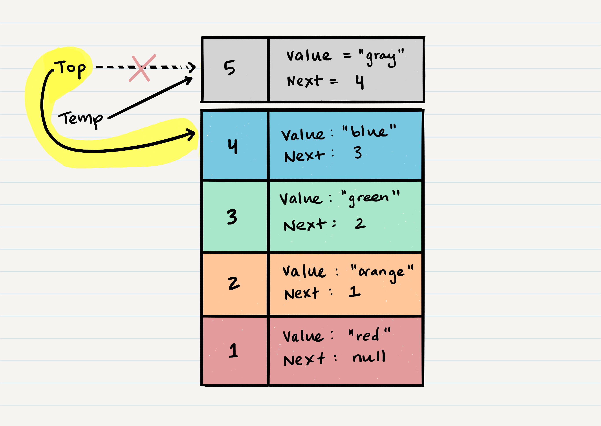

# Stacks
is a data structure that consists of Nodes. Each Node references the next Node in the stack, but does not reference its previous.

## Common terminology for a stack is
  - `Push` - Nodes or items that are put into the stack are pushed
  - `Pop` - Nodes or items that are removed from the stack are popped. When you attempt to pop an empty stack an exception will be raised.
  - `Top` - This is the top of the stack.
  - `Peek` - When you peek you will view the value of the top Node in the stack. When you attempt to peek an empty stack an exception will be raised.
  - `IsEmpty` - returns true when stack is empty otherwise returns false.
- its FILO (first elment enter last out)
- LIFO (Last In First Out)

## Stack Visualization

## Push
- Pushing a Node onto a stack will always be an O(1) operation

## Pop
- check `isEmpty` before conducting a pop When conducting a `pop`, the top Node will be re-assigned to the Node that lives below and the top Node is returned to the user.
- pop a Node onto a stack will always be an O(1) operation

## Peek
-  you will only be inspecting the top Node of the stack.
- O(n)
## IsEmpty 

- O(1)

# Queues
Common terminology for a queue is

`Enqueue` - Nodes or items that are added to the queue.
`Dequeue` - Nodes or items that are removed from the queue. If called when the queue is empty an exception will be raised.
`Front` - This is the front/first Node of the queue.
`Rear` - This is the rear/last Node of the queue.
`Peek` - When you peek you will view the value of the front Node in the queue. If called when the queue is empty an exception will be raised.
`IsEmpty` - returns true when queue is empty otherwise returns false.

- FIFO : First In First Out
- LILO :Last In Last Out

## Queue Visualization

## Enqueue 
- O(1)

## Dequeue 
- O(1)
- you would check isEmpty before conducting a dequeue

## Peek 
-  you want to check isEmpty before conducting a peek
-  you will only be inspecting the front Node of the queue.
- O(1)

## IsEmpty 
- to check if the queue is empty
- O(1)

