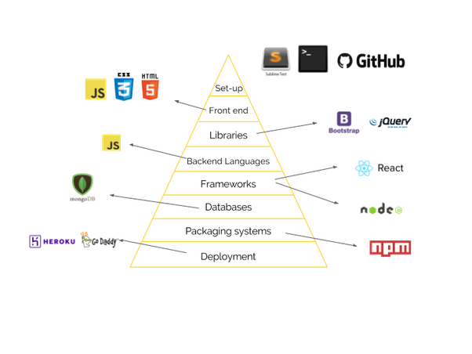
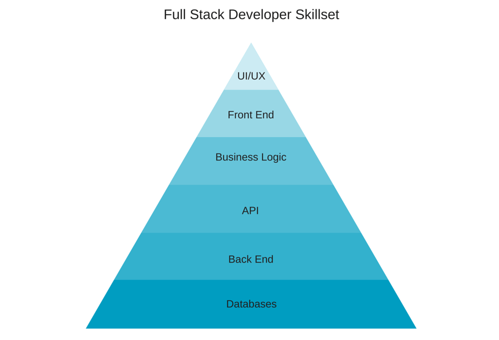

To say that JavaScript is one of the most widely used programming languages today would be an understatement. That’s because JavaScript is all around us, especially powering the World Wide Web, enabling interactive elements on the internet, and being a core component of many web apps.

- Full stack JavaScript developers have a very popular stack to do so, called MEAN, which includes:

  - MongoDB, a NoSQL database program
  - Express, considered the de facto standard server framework for Node.js.
  - AngularJS, a frontend web framework
  - Node.js, a JavaScript runtime environment for server-side scripting

### what is node js, readct, deploy(heroku) ?
**ReactJS:** It is an open-source JavaScript library for building single-page user interfaces.
**Node.js**: Node.js is an open-source and cross-platform runtime environment for executing JavaScript code outside a browser.
**Heroku** extends the platform with a range of tools that support modern development practices, such as continuous delivery. Heroku Flow is a structured deployment workflow that combines tight integrations with GitHub, visually presented pipelines, disposable “review apps” and Heroku CI
example of of deployment :
heroku for bakend and netlify for front end

 and its the way that we start develop ourself :
 

 - The front-end of a website is the part that users interact
 using HTML and CSS and bootstrap and react
 and the backend 

 - So what makes the front-end of a website possible? Where is all that data stored? This is where the back-end comes in. The back- end of a website consists of a server, an application, and a database. 
 using node.js and mongodb for database and heroku for deployment
 